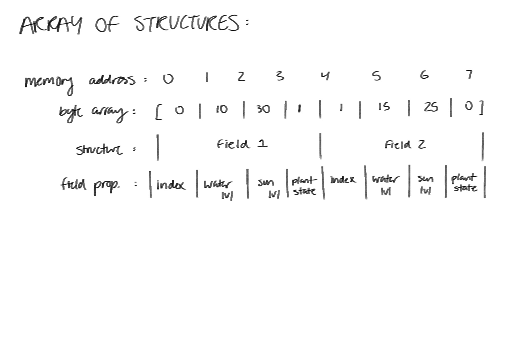

# Devlog Entry - [Nov 13, 2024]
## Introducing the team 

Tools Lead - Dexter Hoang

Engine Lead - Alan Lu

Design Leads - Grace Herman, Yingting Huang

## Tools and Materials
1. For our final project, we intend to use Phaser 3. This is because we have worked with Phaser 3 in CMPM120.

2. The programming languages our team chose was Typescript and JSON. This is because we have a lot of experience using Typescript from this class so we wouldn't have to learn an entirely new langauge. 

3. We plan on using VSCode for writing our code because it is easy for us to collaborate and has tools to easily commit and push changes to our repository. If we have to create visual assets, we will use Pixilart or MagicaVoxel for 2d assets. We chose these tools since most of us have experience using these from a previous class. We are also the most comfortable using a more pixelated style of art for our visual assets. 

4. For our alternate platform, we decided we will still stick with Phaser 3, but our primary lanaguge used will change from Typescript to Javascript. This is because of the many similarities between Typescript and Javascript which will help us greatly when changing our code. 

## Outlook 
Our team hopes to complete this final project in a timely manner without having to rush before the due date. The hardest part of this project would be if we have to make a switch to a different platform/engine. This will not only impact our time, but will require us to transfer our work to an entirely new engine with may differ from our original platform. We are hoping to learn more about our platform and feel more comfortable using it for the future. 

# Devlog Entry - [Dec 3, 2024]

## How we satisfied the software requirements

### [F0.a] The player is able to move over a generated 2D grid using WASD.
### [F0.b] Player can click on a 'Next Day' button to go on to the next day (turn system) to progress through the game.
### [F0.c] When the player is close enough to the grid cell, they are able to click onto asid grid which pops up a menu which allows them to reap (destroy all plants growing there) or sow (plant one of three plants). Clicking the sow button pops up a new menu above the grid which allows them to select the plant they wish so sow. 
### [F0.d] Each grid cell starts off with 0 water and 0 sun. After each day(turn), each cell gets a random amount of water and sun. Sunlight will change from day to day from 0-100 but the water will accumulate over time, gaining a random amount from 0-10 each turn.
### [F0.e] Our three plants, mushrooms, flowers, and herbs, all have 3 distinct stages of growth which the player can visually see as they grow.
### [F0.f] Plants grow based on 2 factors the water accumulated and the sun for that turn. The water and sun need to be passed the threshold in order for the plant to grow which means even if the plant has enough water, it needs a day(turn) when there is enough sun for it to grow. The same applies to plants growing from stage 2 to 3 except the threshold is higher. When the player plants something on a tile, the neighboring tiles are checked to see if there are plants in nearby grids. If they are present, the amount of water needed for growth in increased based on the number of plants nearby.
### [F0.g] When the player successfully grows 10 plants fully (counter at the bottom of the screen), a text will show that says "You Win!".

## Reflection

### After completing this part of the project, we realized that we have to split the workload more evenly with each other. The amount of work was greater than we thought which led us to chrunching on time and staying up late. As a result, we will focus more on our team organization and planning so that everyone does their fair share of work and not a majority of the work gets pushed onto a member(s).

# Devlog Entry - [Dec 5, 2024]

## How we satisfied the software requirements

### [F0.a - F0.g] Same as last week.
### [F1.a] Grid was backed by a single continguous byte array using AoS (Array of Structures) format. The bytes in the array followed the order: index, water level, sun level, and plant state. 
### [F1.b] Game auto-saves every couple of minutes, and everytime the player makes a choice. The player is able to quit out of game, and has the option to resume from their last progress, or start a new game when they come back to the game. 
### [F1.c] There is a save button and a load button. The player has the option to save to three different saving files, and can load from any of the three saving files, including from the last auto-save.
### [F1.d] There's an undo and redo button. The undo button will undo the last move from the player including undoing the status such as the water level and the sun level. The redo button will redo undo moves from the player.

## Reflection

### After completing this part of the project, we realized we couldn't get the requirements done on Untiy so we had to make a quick change to Phaser Typescript. We eneded up changing our engines. After the switch, we were able to work on the requirements more easily. It was We also realized that we should have split the work evenly with everyone instead of splitting the part to only certain memebers. We would work better if everyone worked on the project instead only just splitting these parts for two members to work on it. 
